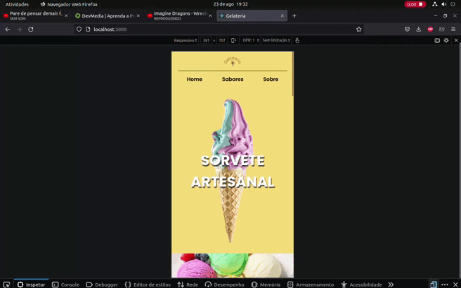

<h1 style="text-align: center"> Criação de uma SPA </h1>

 Resultado final do projeto: 

    

  

 ---------------------------------------------------------------------------- 

 Resultado da parte responsiva:  

    

