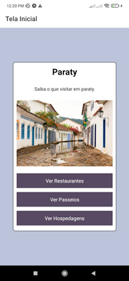
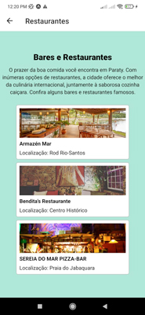
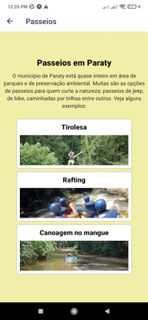
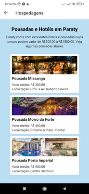

# App React Native

## Sobre

Aplicativo criado com a Devmedia sobre a cidade de Paraty a fim de implementar aprendizados sobre a biblioteca react-navigation

## Screenshots

- Tela inicial:



- Tela restaurantes:



- Tela passeios:



- Tela hospedagens:



## Como usar

1- Clone este repositório:

```
https://github.com/Lucasm4sco/Cursos.git
```

2- Navegue pelo terminal até a pasta atual e execute:

```
npm install
```

3- Após as instalações das dependencias execute:

```
npm start
```

Os passos acimas irão gerar um QRcode que você poderá usar para executar o aplicativo no celular ou emulador.