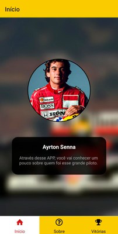
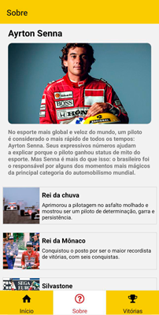
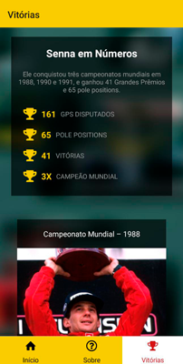

# Projeto React Native

## Sobre

Projeto desenvolvido em React Native que apresenta informações sobre Ayrton Senna, sendo utilizado a navegação em Abas.

## Telas

- Tela Inicial:



- Tela Sobre:



- Tela Vitórias:



## Como usar

1- Clone este repositório:

```git
https://github.com/Lucasm4sco/Cursos.git
```

2- Navegue pelo terminal até a pasta atual e execute:

```node
npm install
```

3- Após as instalações das dependencias execute:

```node
npm start
```

Os passos acimas irão gerar um QRcode que você poderá usar para executar o aplicativo no celular ou emulador.
