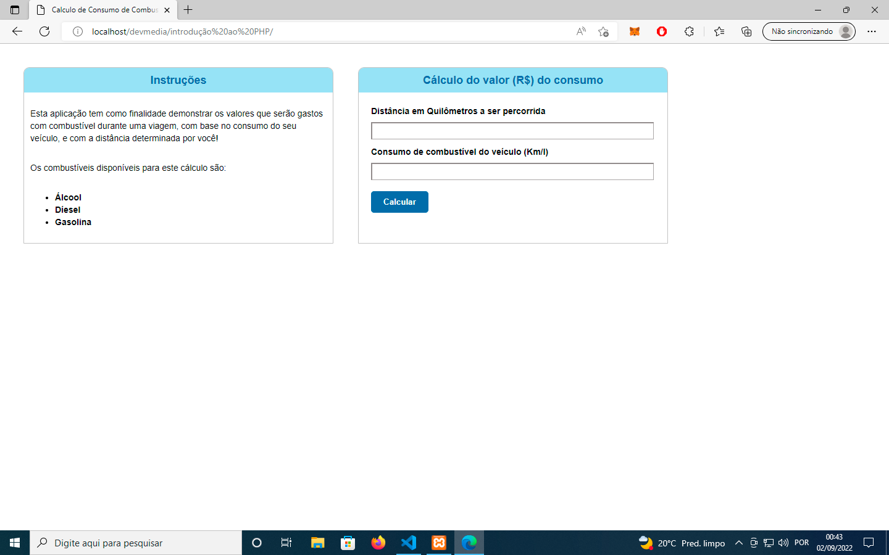
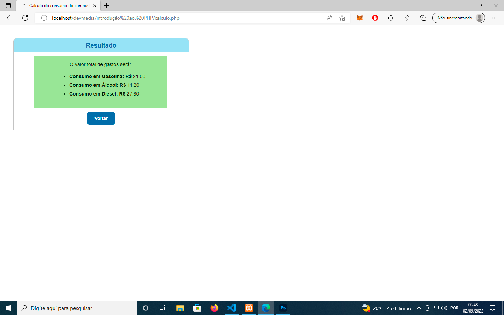
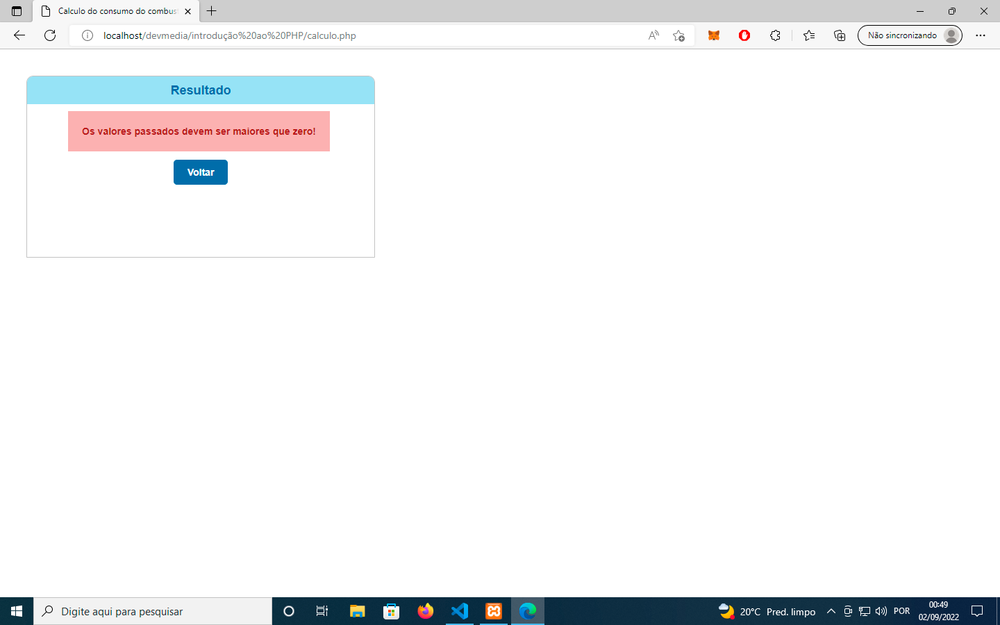

<h1>Projeto de introdução ao PHP</h1>

O código consiste em uma calculadora de gastos em combustíveis, suas partes são:

-------------------------------------------------------------------------

Tela inicial:

-------------------------------------------------------------------------

Resultado do cálculo: 

-------------------------------------------------------------------------

E tratamento de possíveis erros: 

